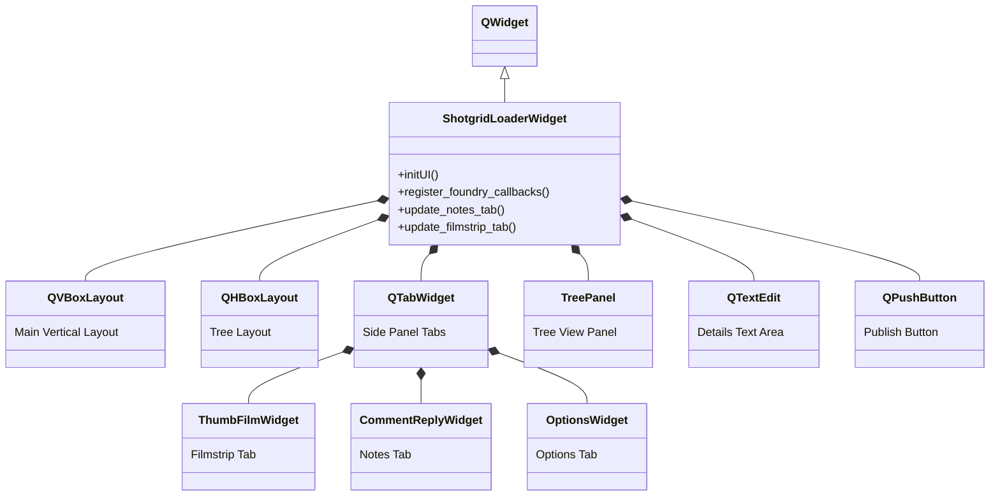
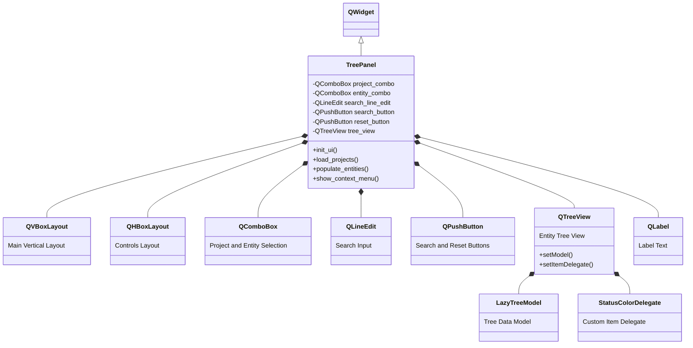

# Nuke Timeline Loader

## Description

This is a functional example to integrate with Shotgrid/Flow for the loading of media into the Foundry Timeline Tools
(Nuke Studio, Hiero and Hiero Player). It is designed to localize/direct attach media from SG into the bin and timelines
Further customization can be done by the studio to better suite their requirements. Currently, the tool is configured to
Playlists and Cuts. The tool has examples of how to display show, shot sequence style schemas

Familiarize yourself with some of the terminology and design in glossary and diagrams.

View Customization to provide an outline of code areas to modify to better suit your studio workflows.

## Table of Contents

- [Installation](#installation)
- [Diagrams](#diagrams)
- [Customization](#customization)
- [Glossary](#glossary)
- [Support/Feedback](#Support)
- [Disclaimer](#disclaimer)
- [License](#license)

## Installation

Depending on your studios infrastructure there are a few approaches which can be used.

If you search ```__INTEGRATE__``` on the contents of files in this repo you can quickly jump to areas that need
alteration for integrating in a studio

### Standalone installation

sets the environment in a batch or sh file pointing to an installation location - currently this is only windows but can
easily be adapted:

- Unzip file to ```c:\nt_loader```
- Update ```Python/Startup/nt_loader/fn_globals.py``` with studio specific connection details
- Edit alternate_location in ```ntl_pip_dependency_installer.py``` to point to your
  installed nuke site packages
- install git if not already installed
- Using a CMD in administrator mode
  ```c:\```
- Update ```launch.bat``` with correct executable for Nuke
- Run ```launch.bat```

### Rez packages

Used to integrate with existing Studio Rez - This requires knowledge of Rez build processes:

- Unzip file to required location for rez build process
- Update ```Python/Startup/nt_loader/fn_globals.py``` with studio specific connection details
- If Hiero not already integrated there is a template package in ```Rez_Example/hiero_example/15.1.1``` be sure to adapt
  to required
  version of Hiero
- With CMD navigate to ```Rez_Example/hiero-nt-loader```
- Alter package.py to suit studio
- Run ```rez build --clean --install```
- On successful build can be launched with ```rez env hiero_nt_loader hiero -- hiero```

## Dependencies

[qtpy](https://pypi.org/project/QtPy/) - QtPy is a QT wrapper that future proofs UI code for future VFX reference
platform updates

[requests](https://pypi.org/project/requests/) - For HTTPS calls to SG REST API and for file downloads. Note: This may
need some extra certificate creation from IT to operate securely currently set to insecure download

[urllib3](https://pypi.org/project/urllib3/) - Modernized url library

[Fileseq](https://pypi.org/project/Fileseq/) - Industry module for handling image sequence based files

[pillow](https://pypi.org/project/pillow/) - PNG file handling for annotations

[opencv-python](https://pypi.org/project/opencv-python/) - Used to capture annotations

[numpy](https://pypi.org/project/numpy/) - Dependency of opencv

[tk-core](https://github.com/shotgunsoftware/tk-core.git) - Uses only Authentication from SGTK core library. <u>Does not
require SGTK to
be installed in studio</u> (this is similar to RV) see ntl_pip_dependency_installer.py to understand installation using
pip

## Diagrams

### Main Widgets Architecture

- provided in mermaid formatting

#### ShotgridLoaderWidget - Python/Startup/nt_loader/fn_ui.py



#### TreePanel - Python/Startup/nt_loader/fn_ui.py



### Data Flow

- Diagram showing how and where manifest entities are created and altered
- Providing paths to calling code to help debug should there be issues

#### Key

- purple = process
- blue = read
- green = write



## Customization

If you search ```__CUSTOMIZE__``` on the contents of files in this repo you can quickly jump to areas that can be
altered to better suite the studios requirements.

# Glossary

This is to help understand some of the terminology used in this tool. It is by no means exhaustive and much of the
functionality of the tool can be derived from the code docstrings and comment

## Manifest

This tool is built to have a very specific functionality when it comes to how it interacts with shotgrid. It is designed
to
have 1 call to retrieve information from shotgrid and create entities within small databases ( json wrapped with mongo
like CRUD )
which are Manifests the
tool then operates from these manifests without the overhead of repeat calls to shotgrid . This approach is a safety
mechanism for a non-destructive workflow that provides the ability debug and see the data at its different stages.

### sg_manifest.json

This manifest is only written to with shotgrid data and is not altered unless a synchronization is done. To keep the
tool
aware of updates the content in this manifest is regularly checked for validity by the treeview model

### fn_manifest.json

This manifest is where all the modification happens . The entities within are what drives the operation of the tool.
ID 0 is reserved for tool options, statuses, and tags passing.
This also provides as safety net when the sg_manifest becomes out of date as you can synchronize without loss of edits.
This manifest is used to send the edits back to shotgrid.

## Localize

For the most part the localization of content means to create a mirror of the shotgrid entity information .
When direct linking content use Hiero's caching mechanisms to improve playback.
There is commented out functionality that will actually copy content from the given locations this
functionality is untested at scale and is to give an example should the studio wish to do multisite reviews

## Entity

This refers to any content in Shotgrid and in the Manifests that will be used to operate this tool

### SG Entity - sg_manifest

The entities in the sg_manifest go mostly unchanged except for cut and playlist entities

### Cut - sg_manifest

The cut entity has the cut_items expanded when entered to the manifest

### Playlist - sg_manifest

The playlist entities have an extra key added which is and expansions of PlaylistSortOrder ensuring the versions
linked to the playlist can be sorted correctly for the timeline

### FN Entity - fn_manifest

The entities in this manifest are for the operation of the tool

### FoundryBaseEntity - fn_manifest

This entity is reserved for ID 0 and is regularly called to assemble UI elements and provide options for subsequent
functions to unpack

### VersionLink - fn_manifest

This entity is the main driver of the import and timeline assembly functionality. it provides a truncated map of the sg
versions required. This entity is the most likely that a studio would want to customize. By providing a unique "sg_type"
key the import and timeline assembly functionality in fn_hiero_func.py can be branched to do different tasks
IE: If the studio wants to setup logic for Shot

### ImportTask - fn_manifest

This entity is created based on submitted context action to guide import of files to both the Hiero Bin and Timeline.
It acts as a buffer to stop users from doing multiple imports while the tool is already busy. The tool clears theses on
Hiero re-start to avoid action locking that may be from a crash.

### LocalizeStrategy - fn_manifest

This entity is for handling how the media should be linked in the import and timeline. When VersionLink is being
unpacked
it will collect this link to drive import. This is so that there can be a mixed strategy for import. One could have a
timeline built from SG encoded media and also have direct links to storage media.

### AnnotationLink - fn_manifest

This entity is created to drive notes and replies annotations. Because the mandate for this tool is to not dynamically
update from shotgrid the AWS s3 link to any attachments expires in a short period. This entity links to the on disk
files

### NewNote, StatusChange, NoteReply - fn_manifest

These entities are edit based and is added and removed based on the users interactions with the tool. EWhen a publish is
initiated these will be the entities called to drive the SG update . Once a publish is confirmed the tool will remove
these
and synchronized the sg_manifest to ensure up to date

## Context Menu Actions

The right click menu that is provided is driven by a dictionary defined in fn_globals.py: CONTEXT_ACTIONS.
The keys drive "action_stub" in fn_ui.py: ShotgridLoaderWidget.action_stub and TreePanel.action_stub.
These can be modified to add in extra functionality that suits the studios requirements and differing options could be
exposed depending on department etc. Below are the defaults.

### "Localize SG encoded media/s"

uses fn_globals.py: SG_ENCODED_MEDIA_FIELDS to Download the media if permissions allow and import to bin and timeline

### "Direct link to image sequences/s"

uses fn_globals.py: SG_IMAGE_SEQUENCE_FIELDS to Link [LocalizeStrategy](#localizestrategy) this media for import and
timeline

### "Direct link to movie media/s"

uses fn_globals.py: SG_MOVIE_PATH_FIELDS to Link [LocalizeStrategy](#localizestrategy) this media for import and
timeline

### "Sync SG notes"

This will update [sg_manifest.json](#sg_manifest.json) to contain up to date information. this will not affect existing
edits unless the changes conflict with the edits in which case the SG entity trumps the edit.

### "Clear Edits"

Destructive removal of all edits. Cannot be undone . Use with caution - Studios may want to disable this functionality

### "Clear SG Manifests"

Used mainly for debug or troubleshooting. shot a sg manifest become unworkable this will zero it out. This has no link
to
SG and is only removing localized entity information.

### "Change Localize Directory"

Point to a new localization directory. this will re-initialize all manifests.

## Support

This tool will not be released/shipped with any Foundry products and therefore is not supported through the same channels. 
Should you require indepth integration consultation, have feedback or require support please email [nuketimelineloader@foundry.com](nuketimelineloader@foundry.com)

## Disclaimer

This software does not reflect the software design/standards of Foundry. It has been written by a single
creative specialist. There are likely bugs and interesting design choices due to the evolution of the tool.
This tool should be thoroughly tested in your environment to ensure it is suitable and capable.
This tool will likely evolve further over time and future versions will likely have breaking changes.

## License

© Copyright 2024 The Foundry Visionmongers Ltd

Redistribution and use in source and binary forms, with or without modification, are permitted provided that the
following conditions are met:

1. Redistributions of source code must retain the above copyright notice, this list of conditions and the following
   disclaimer.

2. Redistributions in binary form must reproduce the above copyright notice, this list of conditions and the following
   disclaimer in the documentation and/or other materials provided with the distribution.

3. Neither the name of the copyright holder nor the names of its contributors may be used to endorse or promote products
   derived from this software without specific prior written permission.

THIS SOFTWARE IS PROVIDED BY THE COPYRIGHT HOLDERS AND CONTRIBUTORS “AS IS” AND ANY EXPRESS OR IMPLIED WARRANTIES,
INCLUDING, BUT NOT LIMITED TO, THE IMPLIED WARRANTIES OF MERCHANTABILITY AND FITNESS FOR A PARTICULAR PURPOSE ARE
DISCLAIMED. IN NO EVENT SHALL THE COPYRIGHT HOLDER OR CONTRIBUTORS BE LIABLE FOR ANY DIRECT, INDIRECT, INCIDENTAL,
SPECIAL, EXEMPLARY, OR CONSEQUENTIAL DAMAGES (INCLUDING, BUT NOT LIMITED TO, PROCUREMENT OF SUBSTITUTE GOODS OR
SERVICES; LOSS OF USE, DATA, OR PROFITS; OR BUSINESS INTERRUPTION) HOWEVER CAUSED AND ON ANY THEORY OF LIABILITY,
WHETHER IN CONTRACT, STRICT LIABILITY, OR TORT (INCLUDING NEGLIGENCE OR OTHERWISE) ARISING IN ANY WAY OUT OF THE USE OF
THIS SOFTWARE, EVEN IF ADVISED OF THE POSSIBILITY OF SUCH DAMAGE.
